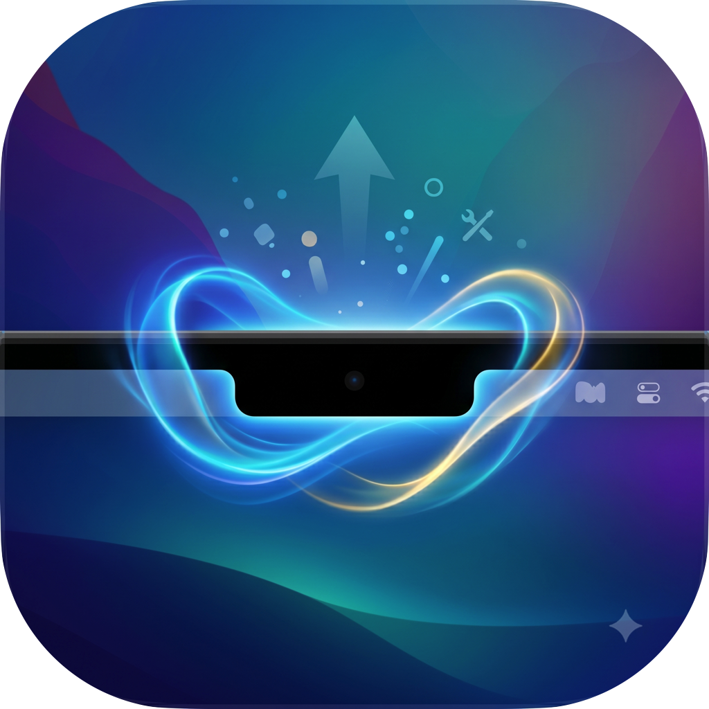

<p align="center">
  
</p>

<h1 align="center">AllNotch</h1>

<p align="center">
  
  
  
  
</p>

<p align="center">Your MacBook notch, elevated.</p>

---

**AllNotch** turns the MacBook notch into a single, native control surface for your whole Mac.

The goal is simple: instead of running a dozen separate menu-bar utilities — one for media controls, one for system stats, one for a clipboard manager, one for timers, one for a drop shelf, one for your AI coding agents — **AllNotch unifies all of those into one app that lives in the notch.** Hover or click the notch and everything is there, contextual and out of the way the rest of the time.

It runs as a lightweight menu-bar agent (no Dock icon), expands the notch into a tabbed surface on demand, and surfaces glanceable "sneak peeks" (volume, music, battery, agent attention…) when the notch is closed.

> **v0.1 "Notch Zero"** — Active development. The full notch UI/UX shell and the Agents tab are working today. The Usage / Cost dashboard is being grafted on next.

---

## What it does

- **Media** — Now-playing controls, artwork, and a live audio visualizer for Apple Music, Spotify, YouTube Music, and any app via Now Playing.
- **System stats** — CPU, GPU, memory, disk, and network gauges with detailed timeline graphs and per-process breakdowns.
- **Shelf** — A drag-and-drop staging area for files, with AirDrop / LocalSend sharing and Quick Look.
- **Clipboard** — Searchable clipboard history.
- **Timers & calendar** — Countdowns, lock-screen widgets, and upcoming calendar events.
- **Agents** — Live AI coding-agent sessions (Claude Code, Codex, Cursor, Gemini, Kimi, OpenCode) right in the notch: see what each session is doing, and approve, deny, or answer prompts inline via hooks.
- **Screen capture & assistant** — Region/fullscreen capture routed straight to the shelf, plus an on-screen AI assistant.
- **Extensions** — Third-party apps can publish live activities, lock-screen widgets, and dedicated notch experiences.

---

## Screenshots

<p align="center">
  
  
</p>
<p align="center">
  
  
</p>

---

## Requirements

- **macOS 14.6+** (macOS 15 recommended)
- **Xcode 15+** with Swift 5.9 toolchain
- A MacBook with a notch (required for full-feature testing)

---

## Build & Run

```bash
git clone https://github.com/thib-crypt/AllNotch.git
cd AllNotch
open AllNotch.xcodeproj
```

Then in Xcode:
- Select your Mac as the destination
- Build & run the **AllNotch** scheme (`⌘R`)
- Grant requested permissions (calendar, location, Bluetooth…)

Swift Package dependencies resolve automatically on first build.

### Ad-hoc signing (no Apple Developer account needed)

```bash
xcodebuild -scheme AllNotch -configuration Debug \
  CODE_SIGNING_ALLOWED=NO CODE_SIGNING_REQUIRED=NO CODE_SIGN_IDENTITY="" \
  build
```

---

## Architecture

```
AllNotch/
├── DynamicIsland/           # Main app target (Swift/SwiftUI)
│   ├── components/          # UI views — Notch, Settings, Agents, Shelf…
│   ├── models/              # State, defaults, constants
│   ├── services/            # AgentBridgeController, enrollment…
│   ├── managers/            # System integrations (battery, volume, OSD…)
│   └── Plugins/             # Plugin host + core plugin protocols
└── Packages/
    └── AgentBridge/         # Local SPM package — OpenIslandCore bridge
        └── Sources/
            ├── OpenIslandCore/    # Agent sessions, hooks, usage tracking
            ├── AgentHooks/        # CLI hook runner
            └── AgentSetup/        # Setup CLI
```

The **Plugin** layer decouples optional features from the core; adding a new feature is a single entry in `allPlugins`.

---

## Contributing

Contributions are welcome! Please read [CONTRIBUTING.md](CONTRIBUTING.md) first.

1. Fork the repo and create a feature branch
2. Make your changes following Swift API Design Guidelines
3. Open a pull request against `main` with a clear description

---

## Credits & License

AllNotch is a **fork of [Atoll](https://github.com/Ebullioscopic/Atoll)** and integrates code from:

| Project | Role | License |
|---------|------|---------|
| [Atoll](https://github.com/Ebullioscopic/Atoll) | Notch UI/UX, media, stats, animations | GPL v3 |
| [Open Island](https://github.com/Octane0411/open-vibe-island) | AI-agent bridge, hook system | GPL v3 |
| [CodexIsland](https://github.com/ericjypark/codex-island) | Token usage & cost visualisations | MIT |

Because it combines GPL v3 sources, **AllNotch is distributed under the [GNU General Public License v3](LICENSE)**. Original copyright notices are retained in source headers as required.

---

<p align="center">Made with ❤️ — <a href="https://github.com/thib-crypt/AllNotch">AllNotch</a></p>
